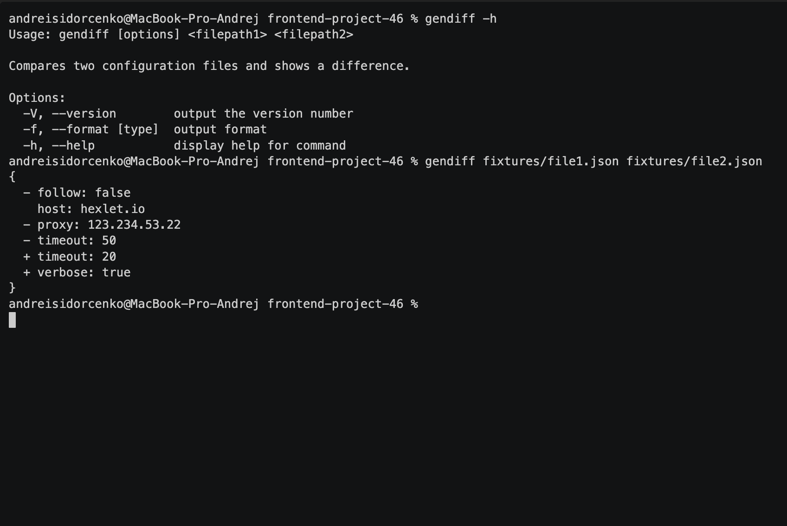

# Difference Calculator

Diff calculator is a command-line tool that analyzes two files with data in JSON or YAML/YML formats and outputs the difference between them in a convenient-to-read format. Three variants of displaying differences are supported: stylish, plain, and json.

## Installation
To get started with Difference Calculator, follow these simple steps:

1. Clone this repository:
    **git clone https://github.com/Disielsida/frontend-project-46.git**

2. Navigate to the project directory:
    **cd frontend-project-46**

3. Install dependencies:
    **npm install**

4. Linking for System-wide Access:
    **sudo npm link**

Now you can use this tool on your computer!

### Hexlet tests and linter status:

 
## Working with flat json files

## System Requirements
This project requires Node.js version 20.10.0 or higher.
Please make sure you have Node.js installed before proceeding with the setup.
